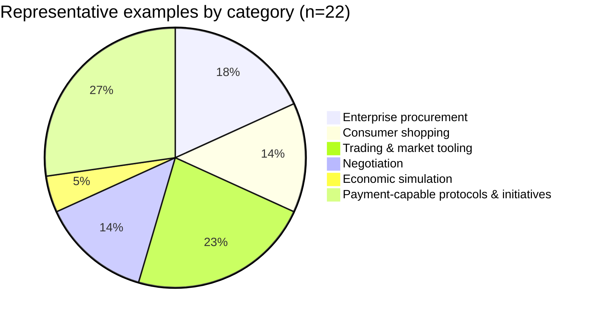
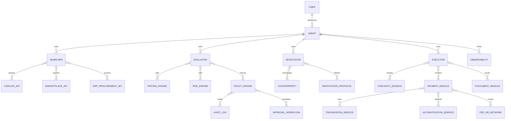

# Deep research report on buyer agents and major variations

## Executive summary

Buyer agents are AI-driven systems that **select, negotiate for, and/or execute purchases** on behalf of a user, business, or portfolio owner. Across the ecosystem, “buyer agent” is not one product class but a **family of agent types** that differ by market interface (catalog vs exchange), autonomy (advice vs execution), and controls (policy, security, certification readiness). The most mature “buyer agents” today cluster in (a) **enterprise procurement copilots/agents** embedded in source-to-pay suites, (b) **consumer shopping assistants** inside retail and payments apps, and (c) **trading bots/agent frameworks** that already execute buys and sells programmatically. citeturn4search0turn0search9turn1search0turn1search2

A distinct and fast-moving subfamily is **payment-capable buyer agents**: agents that can progress from “find and recommend” to “checkout and pay.” In 2025–2026, multiple standards and protocols emerged (or accelerated adoption) to address interoperability and trust, including **Agent Payments Protocol (AP2)** (open protocol, sample implementations), **Universal Commerce Protocol (UCP)** (open standard for interoperable commerce primitives), and **Agentic Commerce Protocol (ACP)** (open standard maintained by OpenAI and Stripe, explicitly labelled “beta” in the repo). citeturn10search2turn6search13turn14view1turn15view2turn6search14

For robust buyer-agent evaluation, the ecosystem increasingly converges on three “must-measure” dimensions: (1) **capability** (does the agent complete workflows correctly), (2) **economic decision quality** (does it choose well under constraints, and is it robust to behavioural distortions), and (3) **security/compliance readiness** (does it handle delegated authority, identity, tokenization, authentication, and payment standards safely). This third dimension is inseparable from card-industry and e-commerce security regimes such as **PCI DSS** (baseline controls for protecting payment account data) and e-commerce authentication protocols like **EMV 3-D Secure**, alongside tokenization specifications such as **EMV Payment Tokenisation**. citeturn3search0turn3search5turn16search2turn11search3turn8search1

Open-source “buyer agents” are unevenly distributed: **trading/market agent tooling is comparatively mature** (e.g., Freqtrade, Hummingbot, LEAN; plus research simulators like ABIDES), while **enterprise procurement agents are mostly commercial** and **payment-capable agent protocols are newer** and still stabilizing governance, security patterns, and certification pathways. citeturn1search0turn1search1turn1search2turn9search2turn15view2turn4search3

## Taxonomy and categories of buyer agents

A practical taxonomy for “buyer agents” has two layers: **domain families** (where the agent buys) and **functional roles** (how it buys). For evaluation and benchmarking, the functional roles are often the stable anchors—because the same role appears in procurement, consumer shopping, and markets.

### Domain families

**Enterprise procurement buyer agents** focus on intake-to-pay/source-to-pay: gathering requirements, finding vendors, running or assisting sourcing events, summarising supplier responses, enforcing policies, and preparing purchase orders/invoices. These agents are commonly embedded in spend-management suites and orchestration platforms (examples in the catalogue include SAP’s procurement AI with Joule and Ariba context, Coupa’s AI platform, Ivalua’s IVA, and Zip’s procurement agents). citeturn4search0turn4search5turn4search6turn4search7

**Consumer shopping agents** assist individuals with discovery, comparison, and increasingly **delegated checkout**. The most consequential shift is from “recommendation” to “execution,” including “buy for me” or “auto-buy” flows that require explicit user authorization and payment guardrails. Amazon’s Rufus has publicly described features like price tracking and user-invoked auto-buy behaviour, and Google has described “agentic checkout” patterns (track price → notify → confirm → buy). citeturn0search9turn5search7turn5search3

**Trading and investment buyer agents** purchase financial assets (equities, crypto, derivatives) and often already operate as **execution agents** (placing orders through broker/exchange APIs). This family includes retail/crypto bots (Freqtrade, Hummingbot), institutional-grade backtesting/execution engines (LEAN), RL-based decision agents (FinRL), and market simulators for agent research (ABIDES). citeturn1search0turn1search1turn1search2turn1search19turn9search2

**Negotiation buyer agents** bargain with suppliers or counterparties (prices/terms) using protocols such as alternating offers, auctions, or mediated mechanisms. Academic platforms and libraries (NegMAS, Genius/GeniusWeb ecosystems, ANL/ANAC competitions) provide structured negotiation environments and baselines for measuring negotiation performance. citeturn9search3turn9search4turn9search13turn9search1

**Autonomous economic agents and market simulators** model societies/markets with multiple agents, sometimes learning policies through RL (e.g., “AI Economist” work by Salesforce’s open-source framework). This family is central if you want to test **economic rationality** and policy outcomes under controlled conditions. citeturn2search0turn2search19

**Payment-capable buyer agents and commerce protocols** focus on interoperable “intent → cart → payment” flows between agents, merchants, and payment providers. Recent work in this area includes AP2 (open protocol + samples), UCP (open interoperability standard), and ACP (open standard maintained by OpenAI and Stripe, explicitly in beta). Large network players have also published agentic-commerce initiatives (e.g., Visa Intelligent Commerce and Trusted Agent Protocol; Mastercard Agent Pay). citeturn15view1turn14view1turn15view2turn11search3turn8search1turn8search14

### Functional roles and cross-cutting variations

Across domains, buyer agents commonly decompose into four roles:

- **Searcher** (finds candidate items/vendors)
- **Evaluator** (scores and selects under constraints)
- **Negotiator** (bargains and updates offers)
- **Executor** (creates orders/transactions and confirms fulfilment)

Planning-based buyer agents (budgeting, replenishment, lifecycle procurement) are usually **Evaluator + Executor** with strong forecasting/state-tracking; governance-aware buyer agents bolt on **policy, audit, and escalation**; behavioural buyer agents are best viewed as **Evaluator variants** tested under systematic bias perturbations; and hybrid agents simply combine more roles end-to-end (e.g., discovery → negotiation → checkout). citeturn9search11turn14view2turn11search3

```mermaid
flowchart TD
  A[Buyer agents] --> B[Enterprise procurement]
  A --> C[Consumer shopping]
  A --> D[Trading & investment]
  A --> E[Negotiation]
  A --> F[Economic simulation & market labs]
  A --> G[Payment-capable commerce agents & protocols]

  B --> B1[Intake-to-procure copilots]
  B --> B2[Sourcing event assistants]
  B --> B3[Contract & compliance assistants]

  C --> C1[Discovery & comparison]
  C --> C2[Price tracking / planning]
  C --> C3[Delegated checkout]

  D --> D1[Signal & portfolio agents]
  D --> D2[Execution bots]
  D --> D3[Backtesting & simulation]

  E --> E1[Bilateral bargaining]
  E --> E2[Auctions / reverse auctions]
  E --> E3[Mediated multi-party mechanisms]

  G --> G1[Intent-cart-payment protocols]
  G --> G2[Identity & agent authentication]
  G --> G3[Tokenization & secure payment execution]
```



## Category comparison matrix

The table below summarises the major buyer-agent categories as they typically appear in the field (not as a guarantee for every product). “Ownership” is the dominant pattern in practice; specific examples are catalogued later.

| Category | Primary use cases | Typical technical architecture/stack | Typical ownership | Typical pricing model | Typical maturity | Key risks that dominate |
|---|---|---|---|---|---|---|
| Enterprise procurement | Intake, sourcing, supplier research, policy checks, approvals, purchase execution | LLM copilot + RAG over spend/contracts/supplier data + workflow engine + ERP/procurement connectors | Commercial suites and orchestration platforms | Enterprise SaaS / “contact sales” | Production (but human-in-loop common) | Policy violations, supplier risk, audit gaps, data leakage |
| Consumer shopping | Discovery, comparison, personalization, “buy for me”/auto-buy with user authorization | Conversational UI + catalogue/marketplace retrieval + recommender + checkout integration | Platforms/retailers/payments apps | Usually bundled/free to consumer | Production and rapidly evolving | Unauthorized purchases, prompt injection via product pages, fraud |
| Trading & investment | Place orders, manage risk, optimize execution, backtest strategies | Strategy engine + market data + broker/exchange API + risk controls; often Python/C# stacks | Open-source projects + commercial platforms | Open-source + SaaS platforms | Production for many tools | Financial loss, market manipulation, compliance/market rules |
| Negotiation | Bargain on price/terms; auctions; mediated negotiation | Negotiation protocol engine + utility models + opponent modelling + logging | Mostly academic/open source | Mostly free/open-source | Research-to-advanced prototype | Misaligned incentives, adversarial counterparties, deception risks |
| Economic simulation & policy | Study market outcomes, policy design, fairness/equity, agent learning | Multi-agent simulator + RL + scenario configs + metrics | Primarily academic + research labs + OSS | Open-source (research) | Research | External validity limits; synthetic-to-real gap |
| Payment-capable commerce protocols | Standardized intent/cart/payment flows; merchant-agent interoperability | Protocol specs + SDKs + signing/credentialing + tokenization + payment provider APIs | Mix of OSS + networks/PSPs | Mostly open specs + commercial implementations | Emerging/beta for standards; production integrations in progress | Credential theft, impersonation, compliance failures, fraud |
| Governance-aware overlays (cross-cutting) | Policy enforcement, audit logging, permission scoping, escalation | Policy-as-code (e.g., OPA), audit trails, approvals, entitlements | OSS + enterprise governance tools | OSS + enterprise | Production in infra; integration varies | Over-permissioning, missing audit, inconsistent enforcement |
| Behavioural/bias testing (cross-cutting) | Evaluate framing/anchoring/default/decoy susceptibility | Scenario perturbations + paired tests + scoring | Research + benchmarking tooling | Mostly open-source research | Emerging | Measuring the wrong “bias” vs legitimate preferences |

The security/compliance axis increasingly references payment-industry standards such as **PCI DSS** (baseline requirements for protecting payment account data) and e-commerce authentication security expectations (e.g., **EMV 3DS** as a fraud-prevention protocol for CNP transactions). citeturn3search0turn3search5turn16search0

## Representative examples catalogue

The catalogue below lists 22 representative examples spanning commercial products, open-source projects, standards/protocols, and academic environments. Where pricing or licensing is not publicly explicit, it is marked “unspecified.” The “Links ID” column maps to a URL directory in the last section (to keep raw URLs inside code blocks).

Key to maturity labels: Production (widely deployed), Emerging (shipping/pilots/early ecosystem), Research (primarily academic), Beta (explicitly labelled beta).

| Example (Links ID) | Category | Short definition and primary use | Typical stack notes | Ownership | Licence | Pricing model | Notable integrations | Maturity | Key limitations/risks | Primary sources |
|---|---|---|---|---|---|---|---|---|---|---|
| Amazon Rufus (E01) | Consumer shopping | Conversational shopping assistant for product discovery and evaluation; includes price history/alerts and user-invoked auto-buy features | Product-catalog retrieval + conversational UI; execution via authorized purchase | entity["company","Amazon","ecommerce and cloud firm"] | unspecified | Consumer-facing (bundled) | Amazon marketplace catalogue; purchase flows in Amazon app | Production | Risk of unintended purchases; manipulation via product content; preference leakage | citeturn0search1turn0search9 |
| Klarna AI shopping assistant (E02) | Consumer shopping | AI assistant in Klarna app for chat-based shopping: finding products, insights, comparison; also tied to payments experience | Conversational UI + product search/recommendation | entity["company","Klarna","payments and shopping platform"] | unspecified | Consumer-facing (bundled) | Klarna shopping + payments ecosystem | Production | Conflicts of interest (recommendations vs monetization); privacy; biased suggestions | citeturn5search2turn5search6 |
| Google AI Mode shopping and agentic checkout (E03) | Consumer shopping | AI-assisted shopping flow including price tracking and “buy for me”/agentic checkout pattern with user confirmation | Search/Shopping retrieval + workflow (track → notify → confirm → buy) | entity["company","Google","search and ads platform"] | unspecified | Consumer-facing (bundled) | Google Shopping surfaces; “agentic checkout” concept | Production/Emerging (features evolving) | Delegated checkout security; transaction dispute handling; merchant acceptance | citeturn5search3turn5search7turn11search15 |
| SAP AI for procurement with Joule and Ariba context (E04) | Enterprise procurement | Procurement AI positioned around Joule + SAP Ariba workflows like refining sourcing events and procurement decision support | Enterprise workflow + procurement domain models + data access across SAP/non-SAP | entity["company","SAP","enterprise software vendor"] | unspecified | Enterprise SaaS (contact sales) | SAP ecosystem; SAP Ariba integration; cross-system workflows | Production/Emerging | Data governance, segregation of duties, auditability, supplier bias | citeturn4search0turn4search4 |
| Coupa AI platform (E05) | Enterprise procurement | AI-native spend management platform positioning AI for recommendations/actions across sourcing, procurement, invoicing, payments | Spend-data intelligence + workflow automation | entity["company","Coupa","spend management software firm"] | unspecified | Enterprise SaaS (contact sales) | Spend management suite; integrations unspecified in public excerpt | Production | Model governance; sensitive spend data exposure; over-automation of approvals | citeturn4search5turn4search9 |
| Ivalua IVA agentic AI for procurement (E06) | Enterprise procurement | IVA described as procurement assistant orchestrating agents across source-to-pay; includes supplier research and contract assistance | Agent orchestration + content generation/summarization + supplier research | entity["company","Ivalua","source-to-pay software firm"] | unspecified | Enterprise SaaS (contact sales) | Source-to-pay workflows; supplier/contract artefacts | Production/Emerging | Hallucinated supplier facts; contract errors; governance and oversight needs | citeturn4search6turn4search2turn4search19 |
| Zip AI procurement platform and agents (E07) | Enterprise procurement | Procurement orchestration platform claiming “purpose-built AI agents,” powered by data from 60+ integrations | Intake-to-pay orchestration + agent layer + integration ecosystem | entity["company","Zip","procurement orchestration company"] | unspecified | Enterprise SaaS (contact sales) | 60+ integrations (public claim); intake/approvals/sourcing workflows | Production/Emerging | Overreliance on integrations; access control drift; audit and compliance | citeturn4search7turn4search3 |
| Freqtrade (E08) | Trading & investment | Open-source crypto trading bot with backtesting and strategy optimisation; controllable via Telegram or web UI | Python bot + exchange integrations + strategy modules | Community project (GitHub org: freqtrade) | GPL-3.0 | Free/open-source | Major crypto exchanges (project claim); Telegram/web UI control | Production (OSS) | Key management; exchange API abuse; strategy risk; compliance depending on jurisdiction | citeturn1search0turn1search8 |
| Hummingbot (E09) | Trading & investment | Open-source framework to build/run automated trading strategies on CEX/DEX | Modular Python framework; bot deployment tooling | Hummingbot Foundation | Apache-2.0 | Free/open-source | CEX and DEX connectivity (project claim) | Production (OSS) | Key custody; market manipulation risk; exchange downtime | citeturn1search5turn1search1turn1search17 |
| LEAN Algorithmic Trading Engine (E10) | Trading & investment | Event-driven open-source algorithmic trading engine supporting research/backtesting and live trading | C# core; algorithms in C# or Python; pluggable components | QuantConnect | Apache-2.0 | Free/open-source engine; platform services are separate | Data providers and brokerages (platform positioning) | Production (OSS + platform) | Requires robust risk controls; data licensing constraints can apply | citeturn1search2turn1search14turn12search0 |
| FinRL (E11) | Trading & investment | Open-source financial reinforcement learning framework intended for education/benchmarking/prototyping trading agents | Python RL pipeline; market environments; research prototyping | AI4Finance Foundation | MIT | Free/open-source | Typically integrates with market datasets/sim environments (research framing) | Research-to-production tooling | Overfitting; sim-to-real gap; market impact not captured | citeturn1search19turn12search13turn12search1 |
| ABIDES (E12) | Trading & investment simulation | Agent-based discrete-event market simulator designed for AI agent research; message-based design modelled after NASDAQ ITCH/OUCH | Python simulator; latency models; exchange agent + participant agents | Georgia Tech authors; open-source community | BSD-3-Clause | Free/open-source | Market microstructure simulation; research use | Research (mature in academia) | External validity limits; calibration; not a brokerage execution stack | citeturn9search2turn10search14turn13view1 |
| NegMAS (E13) | Negotiation | Python library for autonomous negotiation agents embedded in simulation environments; supports multiple protocols and mechanisms | Python; negotiation mechanisms + negotiator strategies | Academic-led open-source project | BSD-3-Clause | Free/open-source | Can model auctions and negotiation protocols | Research/education | Benchmark realism; opponent modelling; deception dynamics | citeturn9search3turn9search11turn2search1 |
| GeniusWeb and negotiation platforms ecosystem (E14) | Negotiation | Open architecture for negotiation via the internet; provides protocols and a Java reference implementation | Java reference components + protocols + JSON serialization | TU Delft Intelligent Interaction group | unspecified | Free (academic platform) | Used in negotiation research and competitions | Research/education | Integration complexity; limited applicability to commercial procurement without adaptation | citeturn9search4turn9search9 |
| Automated Negotiation League / ANAC (E15) | Negotiation | International tournament ecosystem for negotiating agents; provides structured challenges and evaluation | Competition frameworks + domains + evaluation harnesses | Brown University-hosted ecosystem | unspecified | Free (academic) | Competition environment + leaderboards | Research | Objective hacking; limited transfer to real commercial negotiations | citeturn9search13turn9search1turn9search5 |
| AI Economist / Salesforce foundation framework (E16) | Economic simulation | Modular framework for socio-economic simulations with agents/government; used for RL policy experiments (“AI Economist”) | Python simulator + RL compatibility; scenario components | entity["company","Salesforce","enterprise software and CRM company"] | BSD-3-Clause | Free/open-source | Research simulations; policy learning | Research | Strong assumptions; sim-to-real policy transfer risk | citeturn2search0turn2search19 |
| Agent Payments Protocol AP2 (E17) | Payment-capable protocol | Open protocol with code samples/demos for agent-led payments; repo includes Python and Android scenarios; v0.1.0 release noted | Protocol spec + reference samples; Python-heavy; ADK/Gemini used in samples but not required | entity["company","Google Cloud","cloud services platform"] (announcement) | Apache-2.0 | Free/open-source protocol + samples | Supports multiple payment types (cards, stablecoins, real-time transfers as described in announcement) | Emerging | Interop not equal to compliance; credential scoping and dispute workflows still hard | citeturn6search14turn15view1turn10search6 |
| Universal Commerce Protocol UCP (E18) | Commerce interoperability | Open standard for interoperable commerce primitives across platforms, businesses, PSPs, credential providers; supports secure checkout sessions (with or without human intervention) | Spec + documentation; multi-language tooling and schema validators | UCP Authors / community | Apache-2.0 | Free/open-source standard | Positioned to work with existing retail infrastructure; compatible with AP2 | Emerging | Merchant adoption and governance; security profiles vary by implementation | citeturn14view1turn6search13turn11search8turn11search2 |
| Agentic Commerce Protocol ACP (E19) | Commerce protocol | Open standard for connecting buyers, AI agents, and businesses to complete purchases; maintained by OpenAI and Stripe; explicitly “beta” | Spec + RFCs + examples; governance model in repo; payment handler concepts | entity["company","OpenAI","ai research and product company"] + entity["company","Stripe","payments infrastructure company"] | Apache-2.0 | Free/open-source standard | Designed for agent-to-merchant commerce; “payment provider” role in spec | Beta/Emerging | Spec churn; implementation security; merchant-of-record boundaries | citeturn15view2turn14view2turn11search7turn11search1 |
| Stripe Agent Toolkit (E20) | Payment tooling | SDKs and toolkits to integrate Stripe APIs into agent workflows via function calling; supports multiple agent frameworks and recommends restricted keys for least-privilege | Python + TypeScript libraries; built atop Stripe SDKs; MCP server support | entity["company","Stripe","payments infrastructure company"] | MIT | Free/open-source toolkit; Stripe services priced separately | Stripe APIs; OpenAI Agents SDK/LangChain/CrewAI/Vercel AI SDK support; restricted API keys guidance | Production (tooling) | Tool over-permissioning; prompt/tool injection; secret/key handling | citeturn14view3turn11search13turn6search15 |
| Visa Intelligent Commerce VIC (E21) | Payment network initiative | APIs and controls to enrol agent-specific tokens, submit user instructions, retrieve payment credentials, and submit purchase outcomes; includes transaction controls on VisaNet | API platform + tokenization + instruction/signal flows | entity["company","Visa","payment network"] | unspecified | Network/platform program (pricing unspecified) | Mentions VIC APIs, VTS APIs, and an MCP server for integrating Visa APIs | Emerging (pilots + developer platform) | Trust boundaries; liability/disputes; integration gating and access restrictions | citeturn11search3turn11search9turn11search16 |
| Visa Trusted Agent Protocol TAP (E22) | Agent authentication standard | Cryptographic method for agents to prove identity/authorization to merchants; merchant processes include key retrieval and signature verification; sample code subject to Visa terms | Signature-based auth pattern; sample implementations; registry services | entity["company","Visa","payment network"] | Custom terms (Visa Developer Terms/Product Terms) | Typically free access gated by program terms | Merchant verification workflows; signature/key registry patterns | Emerging | Not automatically “secure” end-to-end; depends on merchant enforcement and credential governance | citeturn8search4turn10search16turn15view0turn10search13 |
| Mastercard Agent Pay (E23) | Payment network initiative | Mastercard infrastructure for “secure, scalable and trusted” agentic payments; public statements indicate work with partners (e.g., Microsoft Copilot Checkout) | Network-level trust + acceptance frameworks + tokenized payment flows (public positioning) | entity["company","Mastercard","payment network"] | unspecified | Network/platform program (pricing unspecified) | Partner ecosystem; acceptance/trust positioning | Emerging | Merchant acceptance; governance; fraud/liability; unclear certification path in public docs | citeturn8search14turn8search0turn8search13 |

### Quick distribution chart of representative examples



(Counts are based on the examples in this report.)

## Reference technical architectures and component model

Most buyer agents that are credible for real use look less like a single monolithic “chatbot” and more like **a graph of constrained modules**. This is especially true once payment is in scope, because authorization, tokenization, authentication, and auditability become first-class.

### Component roles and relationships



This model aligns with how newer agentic-commerce standards frame interoperability: “platforms/agents/apps ↔ businesses ↔ payment service providers ↔ credential providers,” with protocol primitives to support secure sessions and consistent handoffs. citeturn14view1turn15view2turn11search3

### Protocol-centric “intent → cart → payment” flow

To see why protocols like AP2/UCP/ACP exist, it helps to draw the recurring flow they are trying to standardize:


AP2 positions itself as a shared protocol for secure, compliant transactions between agents and merchants and explicitly highlights support for different payment types. citeturn6search14turn15view1  
UCP explicitly frames interoperability among platforms/agents/apps, businesses, PSPs, and credential providers for secure checkout sessions. citeturn14view1turn6search13  
ACP explicitly includes a “payment providers” role in the spec and is labelled beta with a formal governance model in the repo. citeturn15view2turn15view2

## Key limitations, risks, and what a robust benchmark must measure

A robust open-source buyer-agent benchmark that spans procurement, consumer commerce, and payments needs to treat “security/compliance” as a **first-class objective**, not an afterthought. In payment contexts, baseline expectations are shaped by standards such as **PCI DSS** (protecting payment account data) and e-commerce authentication security practices like **EMV 3DS**; tokenization is also a core pillar of modern payment security models (e.g., EMV Payment Tokenisation and network token services). citeturn3search0turn3search5turn16search2turn3search2turn3search11

You also need a benchmark to be honest about what it can and cannot infer from outcomes. Below are risk categories that repeatedly break buyer agents in practice:

- **Authority and delegation failures**: agents that can “act” must be constrained to explicit mandates, scoped spending, merchant allowlists, and revocation; otherwise evaluation stops being about intelligence and becomes about incident response. Visa’s Trusted Agent Protocol materials focus on signature verification and merchant-side processes to validate agent legitimacy/authorization, reflecting this exact problem. citeturn8search4turn10search13

- **Credential and token handling**: any agent that touches payment credentials must avoid long-lived secret exposure, enforce least privilege, and isolate tools. Stripe’s agent toolkit documentation explicitly recommends restricted keys and notes tool availability is bounded by those permissions, illustrating best practice for “agent tool” design in payments. citeturn14view3turn6search15

- **Merchant interoperability and protocol volatility**: a benchmark must track protocol versions and conformance profiles. ACP’s repo shows versioned spec snapshots (initial release and subsequent enhancements) and states beta status, meaning implementations may shift quickly. citeturn15view2turn14view2

- **Fraud and adversarial manipulation**: buyer agents are natural targets for (a) prompt injection embedded in product descriptions, (b) price anchoring manipulation, (c) fake scarcity signals, and (d) refund/chargeback exploitation. Protocols and network initiatives (Visa Intelligent Commerce, Mastercard Agent Pay) explicitly frame “tools and safeguards” and “trust” as central, signalling that fraud and disputes are core constraints, not edge cases. citeturn11search9turn8search14turn8search0

- **Economic irrationality disguised as “helpfulness”**: shopping agents that are persuasive but economically inconsistent are dangerous. A benchmark should measure regret/optimality gaps under constraints, plus robustness to framing/anchoring/default effects. This is particularly relevant because procurement and negotiation are increasingly impacted by AI-based negotiation systems and chatbots, but behavioural impacts are still actively studied. citeturn0search4

- **Governance and AI risk management alignment**: for organisations aiming at certification-style readiness, map benchmark controls to AI governance and risk standards. ISO/IEC 42001 defines requirements for an AI management system, and ISO/IEC 23894 provides AI risk management guidance; these are relevant scaffolds for buyer-agent governance claims even when payment certification is separate. citeturn7search0turn7search1turn7search19

A practical benchmark design implication: **separate “capability score” from “permission- and policy-violation score.”** An agent that “succeeds” by breaking policy or overstepping authority must not be rewarded. Payment-oriented standards reinforce this by anchoring security as baseline requirements (e.g., PCI DSS as a baseline; PCI 3DS SDK security standard for SDK security in EMV 3DS contexts). citeturn3search0turn16search0

## Prioritized sources and links directory

### Prioritized sources used most heavily

Primary/official sources were prioritized, especially vendor documentation, GitHub repos, and standards bodies:

- Payment and security standards: PCI DSS and PCI 3DS SDK Security Standard from the entity["organization","PCI Security Standards Council","payments security standards body"]; EMV 3DS and EMV Payment Tokenisation from entity["organization","EMVCo","payments standards organization"]. citeturn3search0turn16search0turn3search5turn16search2  
- Agentic payments and commerce protocols: AP2 (Google Cloud announcement + GitHub), UCP (Google Developer Blog + GitHub + docs), ACP (GitHub + OpenAI docs). citeturn6search14turn15view1turn6search13turn14view1turn15view2turn11search7  
- Network initiatives: Visa Intelligent Commerce and Trusted Agent Protocol; Mastercard Agent Pay. citeturn11search3turn8search4turn8search14turn8search0  
- Trading/market agent tooling: Freqtrade, Hummingbot, LEAN, FinRL, ABIDES (repos + papers). citeturn1search0turn1search1turn1search14turn1search19turn9search2  
- Procurement agents (commercial): SAP AI for procurement (Joule/Ariba positioning), Coupa AI platform, Ivalua IVA, Zip AI agents. citeturn4search0turn4search5turn4search6turn4search7  

### Links directory (raw URLs)

All URLs are provided in code blocks to keep formatting consistent.

```text
E01 Amazon Rufus
Official: https://www.aboutamazon.com/news/retail/amazon-rufus
Update:   https://www.aboutamazon.com/news/retail/amazon-rufus-ai-assistant-personalized-shopping-features

E02 Klarna AI shopping assistant
Official: https://www.klarna.com/international/press/shopping-made-smarter-klarna-adds-more-ai-features-to-its-assistant-powered-by-openai/
Official: https://www.klarna.com/international/press/klarna-ai-assistant-handles-two-thirds-of-customer-service-chats-in-its-first-month/

E03 Google AI Mode shopping and agentic checkout
Official: https://blog.google/products-and-platforms/products/shopping/google-shopping-ai-mode-virtual-try-on-update/
Official: https://business.google.com/us/think/search-and-video/google-shopping-ai-mode-virtual-try-on-update/
UCP on Google surfaces (docs): https://developers.google.com/merchant/ucp/guides

E04 SAP AI for procurement (Joule + Ariba context)
Official: https://www.sap.com/products/spend-management/ai-for-procurement.html
Official: https://www.sap.com/products/artificial-intelligence/ai-assistant.html

E05 Coupa AI platform
Official: https://www.coupa.com/platform/ai/
Official: https://www.coupa.com/platform/

E06 Ivalua IVA agentic AI
Official: https://www.ivalua.com/technology/agentic-ai/
Official: https://www.ivalua.com/press-releases/ivalua-supercharges-procurement-with-the-power-of-generative-ai/

E07 Zip AI procurement platform
Official: https://ziphq.com/ai
Official: https://ziphq.com/

E08 Freqtrade
Repo:    https://github.com/freqtrade/freqtrade
License: https://github.com/freqtrade/freqtrade/blob/develop/LICENSE

E09 Hummingbot
Repo:    https://github.com/hummingbot/hummingbot
Docs:    https://hummingbot.org/docs/
Site:    https://hummingbot.org/

E10 LEAN Algorithmic Trading Engine (QuantConnect)
Repo:    https://github.com/QuantConnect/Lean
License: https://github.com/QuantConnect/Lean/blob/master/LICENSE
Site:    https://www.lean.io/

E11 FinRL
Repo:    https://github.com/AI4Finance-Foundation/FinRL
License: https://github.com/AI4Finance-Foundation/FinRL/blob/master/LICENSE
Paper:   https://arxiv.org/abs/2011.09607
Org:     https://ai4finance.org/

E12 ABIDES
Repo:    https://github.com/abides-sim/abides
License: https://github.com/abides-sim/abides/blob/master/LICENSE.txt
Paper:   https://arxiv.org/abs/1904.12066

E13 NegMAS
Repo:    https://github.com/yasserfarouk/negmas
Docs:    https://negmas.readthedocs.io/

E14 GeniusWeb / Genius negotiation platforms
GeniusWeb: https://ii.tudelft.nl/GeniusWeb/
Genius:    https://ii.tudelft.nl/genius/

E15 Automated Negotiation League / ANAC
ANL:  https://scml.cs.brown.edu/anl
ANAC: https://scml.cs.brown.edu/

E16 AI Economist (Salesforce)
Repo: https://github.com/salesforce/ai-economist

E17 Agent Payments Protocol (AP2)
Repo: https://github.com/google-agentic-commerce/AP2
Site: https://agentpaymentsprotocol.info/
Announcement: https://cloud.google.com/blog/products/ai-machine-learning/announcing-agents-to-payments-ap2-protocol

E18 Universal Commerce Protocol (UCP)
Repo: https://github.com/universal-commerce-protocol/ucp
Site: https://ucp.dev/
Announcement: https://developers.googleblog.com/under-the-hood-universal-commerce-protocol-ucp/
Docs (Google Pay API): https://developers.google.com/pay/api/universal-commerce-protocol/overview

E19 Agentic Commerce Protocol (ACP)
Repo: https://github.com/agentic-commerce-protocol/agentic-commerce-protocol
Site: https://www.agenticcommerce.dev/
OpenAI docs: https://developers.openai.com/commerce/

E20 Stripe Agent Toolkit / Stripe AI repo
Repo: https://github.com/stripe/ai
Docs: https://docs.stripe.com/agents

E21 Visa Intelligent Commerce
Corporate: https://corporate.visa.com/en/products/intelligent-commerce.html
Developer:  https://developer.visa.com/capabilities/visa-intelligent-commerce

E22 Visa Trusted Agent Protocol
Developer: https://developer.visa.com/capabilities/trusted-agent-protocol
Repo:      https://github.com/visa/trusted-agent-protocol

E23 Mastercard Agent Pay
Story: https://www.mastercard.com/global/en/news-and-trends/stories/2026/agentic-commerce-rules-of-the-road.html
Product: https://www.mastercard.com/global/en/business/artificial-intelligence/mastercard-agent-pay.html

Security and standards references
PCI DSS (overview): https://www.pcisecuritystandards.org/standards/pci-dss/
PCI 3DS SDK Security Standard: https://www.pcisecuritystandards.org/standards/pci-3ds-sdk/
EMV 3-D Secure (overview): https://www.emvco.com/emv-technologies/3-d-secure/
EMV Payment Tokenisation (overview): https://www.emvco.com/emv-technologies/payment-tokenisation/
ISO/IEC 42001 (AI management systems): https://www.iso.org/standard/42001
ISO/IEC 23894 (AI risk management): https://www.iso.org/standard/77304.html
NIST AI RMF: https://www.nist.gov/itl/ai-risk-management-framework
ISO 20022 overview (SWIFT): https://www.swift.com/standards/iso-20022/iso-20022-standards
```